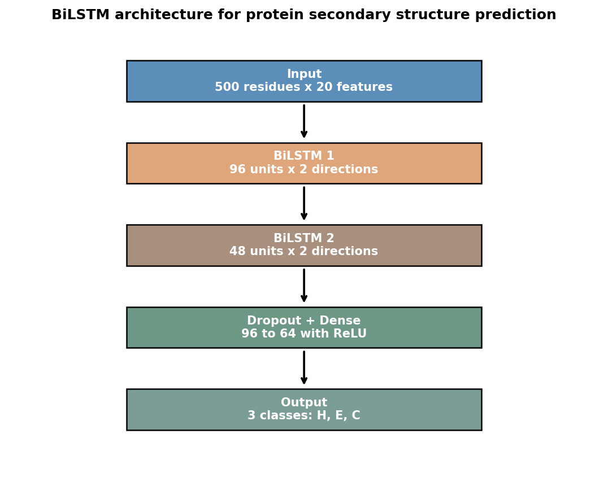
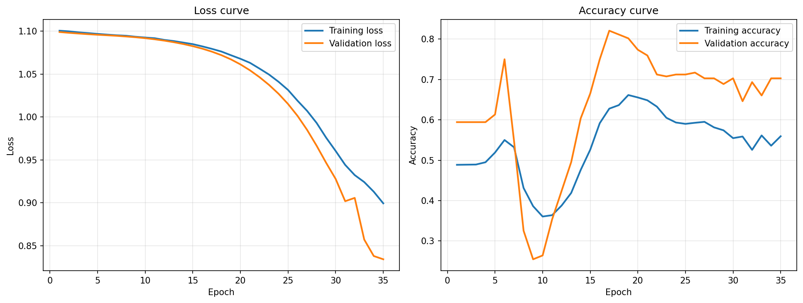
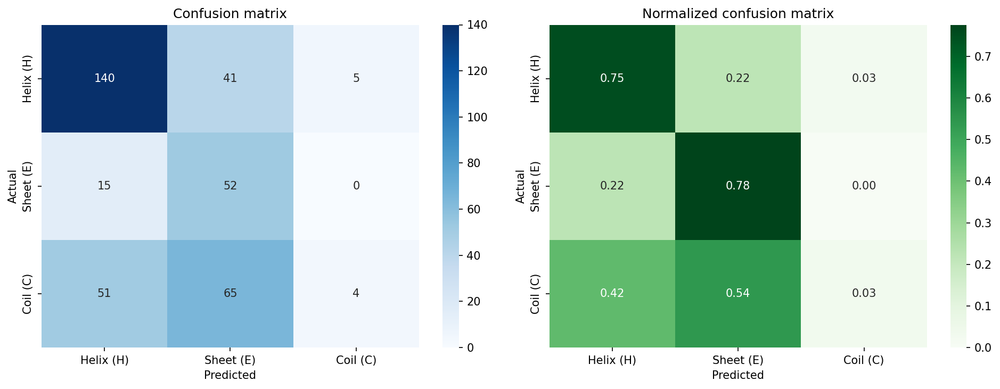
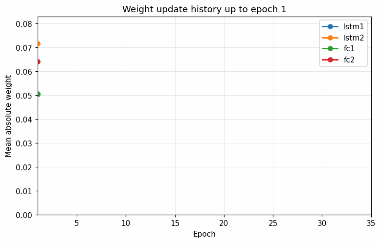

# Protein 2D Structure Prediction Using Deep Learning

This project predicts protein secondary structure classes from amino acid sequences using a Bidirectional LSTM model. The three target classes are:

- Helix (H)
- Sheet (E)
- Coil (C)

The full workflow includes data collection from NCBI, preprocessing, one-hot encoding, model training, evaluation, visualization, and weight update GIF generation.

## Project Files

| File/Folder | Description |
|---|---|
| `protein_structure_prediction.ipynb` | Main notebook containing the full project code |
| `Protein_2D_Structure_Prediction_Report_Final.docx` | Final formatted assignment report |
| `protein_assignment_outputs/` | Saved model, FASTA file, graphs, model diagram, and GIFs |
| `protein_assignment_outputs/collected_sequences.fasta` | Collected and cleaned protein sequences |
| `protein_assignment_outputs/bilstm_protein_model.pth` | Saved trained PyTorch model |

## Dataset

Protein sequences were collected from the NCBI Protein Database using Biopython Entrez. Different human protein groups were searched to make the dataset more diverse, including hemoglobin, insulin, collagen, kinase, myosin, and transporter proteins.

| Item | Value |
|---|---:|
| Raw sequences collected | 42 |
| Final usable sequences | 21 |
| Shortest sequence | 43 residues |
| Longest sequence | 1160 residues |
| Average sequence length | 240.8 residues |
| Train/validation/test split | 14 / 3 / 4 |
| Input shape | `(21, 500, 20)` |

## Preprocessing

The preprocessing steps were:

1. Remove non-standard amino acid symbols.
2. Keep sequences between 40 and 1200 residues.
3. Convert each amino acid into one-hot encoding with 20 features.
4. Pad or truncate each sequence to 500 residues.
5. Generate approximate secondary-structure labels using amino-acid tendency rules.
6. Split the dataset into training, validation, and test sets.

The labels are approximate because FASTA sequences do not directly contain experimental DSSP secondary-structure labels. This is a limitation of the project, but it keeps the full deep learning workflow runnable for the assignment.

## Model Architecture

The model is a Bidirectional LSTM. It was selected because protein sequences are ordered data, and the class of one residue can depend on residues before and after it.

Model summary:

- Input: 500 residues x 20 amino acid features
- BiLSTM layer 1: 96 hidden units in each direction
- BiLSTM layer 2: 48 hidden units in each direction
- Dropout layer
- Fully connected layer with ReLU
- Output layer with 3 classes
- Trainable parameters: 189,955

## Training

The model was trained using:

- Loss function: class-weighted cross-entropy
- Optimizer: Adam
- Learning rate: `8e-4`
- Epochs: 35
- Weight tracking: `lstm1`, `lstm2`, `fc1`, and `fc2`

Class-weighted loss was used because the first model mostly predicted Helix. Weighting helped the model pay more attention to Sheet and Coil.

## Evaluation Results

Final test metrics:

| Metric | Value |
|---|---:|
| Accuracy | 0.5255 |
| Weighted precision | 0.5410 |
| Weighted recall | 0.5255 |
| Weighted F1-score | 0.4592 |
| Tested residues | 373 |

Per-class result:

| Class | Precision | Recall | F1-score | Support |
|---|---:|---:|---:|---:|
| Helix (H) | 0.68 | 0.75 | 0.71 | 186 |
| Sheet (E) | 0.33 | 0.78 | 0.46 | 67 |
| Coil (C) | 0.44 | 0.03 | 0.06 | 120 |

## Weight Update GIFs

The notebook generates GIFs showing how tracked layer weights changed during training.

| GIF | Description |
|---|---|
| `weight_updates_all_layers.gif` | Combined weight update history |
| `weight_updates_lstm1.gif` | First BiLSTM layer |
| `weight_updates_lstm2.gif` | Second BiLSTM layer |
| `weight_updates_fc1.gif` | First fully connected layer |
| `weight_updates_fc2.gif` | Output fully connected layer |

## Discussion

The model performed best on Helix, with an F1-score of 0.71. Sheet prediction improved after using class-weighted loss, especially recall. Coil was the weakest class because coil regions are more irregular and harder to detect from simple sequence patterns.

The accuracy and F1-score are moderate because the dataset is small and the labels are approximate. A stronger version of this project would use experimentally verified DSSP/PDB labels and a larger dataset.

## Future Improvements

- Use DSSP or PDB-based real secondary-structure labels.
- Increase the number of protein sequences.
- Try pretrained protein embeddings.
- Compare BiLSTM with CNN, GRU, and Transformer models.
- Tune hyperparameters with a larger validation set.

## How to Run

1. Open `protein_structure_prediction.ipynb`.
2. Restart the notebook kernel/runtime.
3. Run all cells from top to bottom.
4. Check generated files inside `protein_assignment_outputs/`.

## References

- NCBI Protein Database
- Biopython Entrez and SeqIO documentation
- PyTorch LSTM documentation
- Chou-Fasman secondary structure prediction concept
